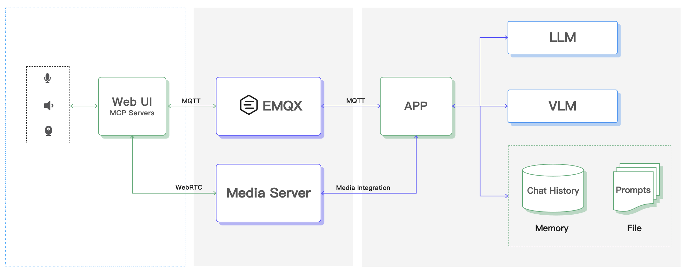

# 硬件智能体演示项目

基于 EMQX MCP、Agent、LLM、VLM、ASR 和 TTS 技术的硬件智能体演示项目。适用于情感陪伴玩具、智能家电、智能家居和具身智能等应用场景。

## 项目简介

该项目实现了一个功能完整的智能体，用户能够通过语音和视觉与用户进行自然交互，并控制各种智能设备。该智能体具备以下核心能力：

- **语音识别与合成**：接入语音流，实现实时语音识别和自然语音合成
- **视觉理解**：基于图片识别的多模态大模型 (VLM) 进行视觉内容理解
- **智能推理**：结合 LLM 和 Agent 技术，生成符合人物设定的智能回复
- **设备控制**：通过 MCP over MQTT 协议控制摄像头、扬声器等外设

## 系统架构



## 技术特点

- **MQTT 通信**：基于 MQTT 协议实现数据上报和设备控制，具备低延时、轻量、节能等优势
- **智能控制**：根据 LLM 推理结果，通过 MCP over MQTT 控制硬件设备，提升智能化程度
- **多媒体流**：基于 WebRTC 的稳定多媒体流服务，支持语音活动检测 (VAD) 和语音打断
- **灵活扩展**：高度灵活的 Agent 实现，可接入各种第三方模型，支持自定义业务逻辑
- **私有部署**：支持全球多地就近接入，提升安全性，有效控制成本

## 快速开始

```shell
git clone git@github.com:mqtt-ai/mcp-ai-companion-demo.git
cd mcp-ai-companion-demo
# todo ...
```

## 项目结构

### web

智能体前端界面，提供用户交互界面和设备控制功能。基于 React + TypeScript + Vite + Tailwind CSS + shadcn/ui + MQTT.js，实现 MCP over MQTT 协议通信。

**要求**: Node.js >= 22.0.0

```bash
cd web
pnpm install
pnpm dev
```

### app

该目录下为 Agent 的代码，包含了跟多媒体服务交互，与 LLM、VLM 调用和交互的实现

**要求**: Python >= 3.11, uv

```bash
cd app
uv sync
uv run main.py
```

## 联系我们

如果您对该演示项目或解决方案感兴趣，想了解商业化的产品和服务，请[联系我们](https://www.emqx.com/zh/contact)。
