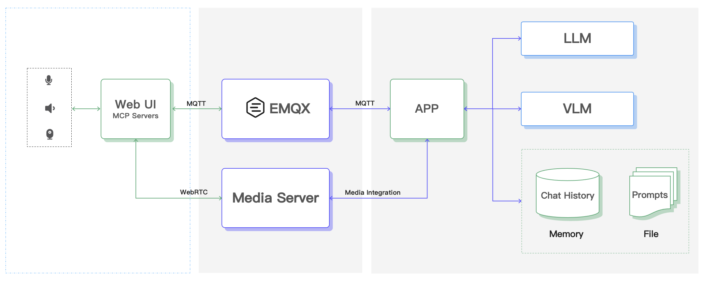

# Hardware Intelligence Agent Demo Project

[中文](./README-zh.md)

A hardware intelligence agent demo project based on EMQX MCP, Agent, LLM, VLM, ASR, and TTS technologies. Suitable for applications such as emotional companion toys, smart appliances, smart homes, and embodied intelligence.

## Project Overview

This project implements a fully functional intelligent agent that enables users to interact naturally via voice and vision, and control various smart devices. The agent has the following core capabilities:

- **Speech Recognition & Synthesis**: Integrates speech streams for real-time speech recognition and natural speech synthesis
- **Visual Understanding**: Utilizes multimodal large models (VLM) for image-based visual content understanding
- **Intelligent Reasoning**: Combines LLM and Agent technologies to generate intelligent responses aligned with character settings
- **Device Control**: Controls peripherals such as cameras and speakers via MCP over MQTT protocol

## System Architecture



## Technical Features

- **MQTT Communication**: Implements data reporting and device control based on the MQTT protocol, offering low latency, lightweight, and energy-efficient advantages
- **Intelligent Control**: Enhances intelligence by controlling hardware devices via MCP over MQTT based on LLM reasoning results
- **Multimedia Streaming**: Provides stable multimedia streaming services based on WebRTC, supporting Voice Activity Detection (VAD) and speech interruption
- **Flexible Expansion**: Highly flexible Agent implementation, supports integration with various third-party models and custom business logic
- **Private Deployment**: Supports global access with local proximity, enhancing security and effectively controlling costs

## Quick Start (Volc proxy + Web UI + app)

1. Clone the repo:

```shell
git clone https://github.com/emqx/mcp-ai-companion-demo.git
cd mcp-ai-companion-demo
```

2. Prepare env files:
   - `cp app/.env.example app/.env` (AI Agent layer) and fill `DASHSCOPE_API_KEY`, `CUSTOM_LLM_API_KEY`, and optional upload settings.
   - `cp volc-server/.env.example volc-server/.env` and fill Volc credentials. Set `VOLC_LLM_URL=http://app:8081/chat-stream` and `VOLC_LLM_API_KEY` to match `CUSTOM_LLM_API_KEY` so the proxy can call the app.
   - Set MQTT broker for the app: defaults are `localhost:1883`; override `MQTT_BROKER_HOST`/`MQTT_BROKER_PORT` and optional `MQTT_USERNAME`/`MQTT_PASSWORD` in `app/.env` if needed.
   - Advanced (optional): adjust MCP discovery/prefix via `MCP_SERVER_NAME_PREFIX`, `MCP_SERVER_DISCOVERY_FILTER`, `MCP_REGISTRY_CLIENT_NAME` in `app/.env` (blank = defaults).
   - Optional HTTPS for app (recommended in production): mount certs into the app container (e.g., `./certs:/certs:ro`) and set `APP_SSL_CERTFILE`/`APP_SSL_KEYFILE` (in `app/.env` or via compose env) to the mounted paths. Defaults to HTTP for local runs.

3. Start Volc proxy + Web UI + app:

```bash
docker compose -f docker/docker-compose.web-volc.yml up --build
```

4. Open `http://localhost:8080` for the web UI. The app listens on `http://localhost:8081`, Volc proxy on `http://localhost:3002`.

Compose files:

- `docker/docker-compose.web-volc.yml` — Volc proxy + Web UI + app (AI Agent layer, recommended).
- `docker/docker-compose.legacy.yml` — legacy self-hosted media stack (Postgres + media server + EMQX, non-VolcEngine RTC).

### Local Preview (Volc proxy + Web UI + app)

Bring up the Volc real-time voice proxy together with the web interface and app via Docker:

1. Ensure `app/.env` exists (copy from `.env.example` and fill `DASHSCOPE_API_KEY`, `CUSTOM_LLM_API_KEY`, etc.).
2. Ensure `volc-server/.env` exists (copy from `.env.example`, fill Volc credentials, set `VOLC_LLM_URL=http://app:8081/chat-stream`, `VOLC_LLM_API_KEY` to match `CUSTOM_LLM_API_KEY`).
3. (Optional) export `VITE_AIGC_PROXY_HOST` to override the web build-time API endpoint. It defaults to `http://localhost:3002`, which matches the compose port mapping.
4. Build and start all services:

```bash
docker compose -f docker/docker-compose.web-volc.yml up --build
```

5. Open `http://localhost:8080` for the web UI. The app is at `http://localhost:8081`, Volc proxy at `http://localhost:3002`.

The compose stack exposes containers named `mcp-app`, `mcp-volc-server`, and `mcp-web`, making it easy to identify services in `docker ps`.

Need more detail (including per-image builds or running without local Bun/Node.js)? See [docs/docker-build.md](docs/docker-build.md).

## Project Structure

### web

The frontend interface for the agent, providing user interaction and device control features. Built with React, TypeScript, Vite, Tailwind CSS, shadcn/ui, and MQTT.js, implementing MCP over MQTT protocol communication.

**Requirements**: Node.js >= 22.0.0

```bash
cd web
pnpm install
pnpm dev
```

Optional: copy `.env.example` to `.env` to override the Volc proxy host. Defaults derive from the current page origin, so most local setups work without changes.

### app

Backend agent service implemented in Python. It now exposes an HTTP SSE endpoint as the primary integration surface.

**Requirements**: Python >= 3.11, `uv`

#### Run HTTP SSE server

```bash
cd app
uv sync
uv run --env-file .env python custom_llm_service.py \
  --host 0.0.0.0 \
  --port 8081 \
```

- API: `POST /chat-stream`. Send a JSON body with OpenAI-compatible `messages`. The server responds with an SSE stream (`data: ...` chunks ending with `data: [DONE]`).

#### Legacy CLI mode

The original JSON-RPC / STDIN workflow remains available via `main.py` for legacy integrations:

```bash
cd app
uv sync
uv run --env-file .env python main.py
```

The CLI expects JSON-RPC commands from stdin, typically provided by the media proxy pipeline. Use this mode only if you integrate with the legacy streaming infrastructure; otherwise, prefer the HTTP SSE server above.

## Contact Us

If you are interested in this demo project or solution and want to learn more about commercial products and services, please [contact us](https://www.emqx.com/zh/contact).
