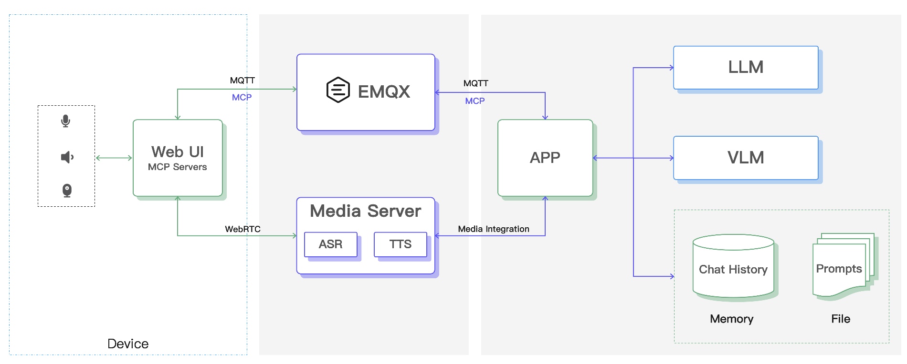

# Hardware Intelligence Agent Demo Project

[中文版](./README-zh.md)

A hardware intelligence agent demo project based on EMQX MCP, Agent, LLM, VLM, ASR, and TTS technologies. Suitable for applications such as emotional companion toys, smart appliances, smart homes, and embodied intelligence.

## Project Overview

This project implements a fully functional intelligent agent that enables users to interact naturally via voice and vision, and control various smart devices. The agent has the following core capabilities:

- **Speech Recognition & Synthesis**: Integrates speech streams for real-time speech recognition and natural speech synthesis
- **Visual Understanding**: Utilizes multimodal large models (VLM) for image-based visual content understanding
- **Intelligent Reasoning**: Combines LLM and Agent technologies to generate intelligent responses aligned with character settings
- **Device Control**: Controls peripherals such as cameras and speakers via MCP over MQTT protocol

## System Architecture



## Technical Features

- **MQTT Communication**: Implements data reporting and device control based on the MQTT protocol, offering low latency, lightweight, and energy-efficient advantages
- **Intelligent Control**: Enhances intelligence by controlling hardware devices via MCP over MQTT based on LLM reasoning results
- **Multimedia Streaming**: Provides stable multimedia streaming services based on WebRTC, supporting Voice Activity Detection (VAD) and speech interruption
- **Flexible Expansion**: Highly flexible Agent implementation, supports integration with various third-party models and custom business logic
- **Private Deployment**: Supports global access with local proximity, enhancing security and effectively controlling costs

## Quick Start

```shell
git clone git@github.com:mqtt-ai/mcp-ai-companion-demo.git
cd mcp-ai-companion-demo
# todo ...
```

## Project Structure

### web

The frontend interface for the agent, providing user interaction and device control features. Built with React, TypeScript, Vite, Tailwind CSS, shadcn/ui, and MQTT.js, implementing MCP over MQTT protocol communication.

**Requirements**: Node.js >= 22.0.0

```bash
cd web
pnpm install
pnpm dev
```

### app

This directory contains the Agent code, including interaction with multimedia services and the implementation for calling and interacting with LLM and VLM.

**Requirements**: Python >= 3.11, uv

```bash
cd app
uv sync
uv run main.py
```

## Contact Us

If you are interested in this demo project or solution and want to learn more about commercial products and services, please [contact us](https://www.emqx.com/zh/contact).
