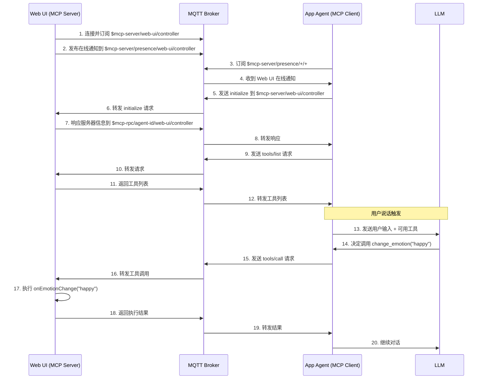

# MCP over MQTT 实现文档

## 架构概述

本项目实现了 MCP (Model Context Protocol) over MQTT 规范，让 Web UI 作为 MCP Server 提供硬件控制能力，供 AI Agent 调用。

### 系统角色

- **Web UI** = **MCP Server** - 提供硬件控制工具（摄像头、表情）
- **App Agent (Python)** = **MCP Client** - 接收语音，调用 LLM，执行工具调用
- **MQTT Broker** = **消息路由** - 负责消息传递和路由

### 数据流向

```
用户语音 → App Agent → LLM 推理 → 调用 Web UI 工具 → 硬件控制
                ↓                        ↓
            ASR 识别              通过 MQTT 发送请求
```

## 核心组件实现

### 1. MCP Server 类 (`lib/mcp-mqtt-server.ts`)

```typescript
export class McpMqttServer {
  private mqttClient: BaseMqttClient       // MQTT 底层连接
  private serverId: string                 // 服务器唯一标识
  private serverName: string               // 服务器名称
  private callbacks: {                     // 硬件控制回调函数
    onCameraControl?: (enabled: boolean) => void
    onEmotionChange?: (emotion: string) => void
  }
}
```

**关键点**：

- 使用 `mqttClient` 命名避免与 MCP Client 概念混淆
- 通过 `callbacks` 将硬件控制逻辑与协议层解耦

### 2. 服务注册与发现

Server 启动时需要：

1. 订阅控制主题接收请求
2. 发布在线通知让 Client 发现

```typescript
private async subscribeToMcpTopics(): Promise<void> {
  // 1. 订阅控制主题，接收 initialize 请求
  const controlTopic = `$mcp-server/${this.serverId}/${this.serverName}`
  await this.subscribe(controlTopic)
  
  // 2. 发布在线通知（带 RETAIN 标志，保证新连接的 Client 能收到）
  const presenceTopic = `$mcp-server/presence/${this.serverId}/${this.serverName}`
  const onlineNotification = {
    jsonrpc: '2.0',
    method: 'notifications/server/online',
    params: {
      server_name: this.serverName,
      description: 'Web UI hardware controller for camera and emotion control'
    }
  }
  await this.publish(presenceTopic, JSON.stringify(onlineNotification), { retain: true })
}
```

### 3. 请求处理机制

Server 需要处理三种核心请求：

```typescript
private handleMcpMessage(message: MqttMessage): void {
  const data = JSON.parse(message.payload) as JsonRpcRequest
  
  // 从主题中提取 Client ID 用于响应路由
  const topicParts = message.topic.split('/')
  let clientId = ''
  
  if (message.topic.startsWith('$mcp-server/')) {
    // 控制主题 - 初始化请求
    clientId = 'unknown' // 将在 initialize 后更新
  } else if (message.topic.startsWith('$mcp-rpc/')) {
    // RPC 主题 - 格式: $mcp-rpc/{client-id}/{server-id}/{server-name}
    clientId = topicParts[1]
  }
  
  // 根据方法分发处理
  switch (data.method) {
    case 'initialize':
      this.handleInitializeRequest(data, clientId)
      break
    case 'tools/list':
      this.handleToolsListRequest(data, clientId)
      break
    case 'tools/call':
      this.handleToolsCallRequest(data, clientId)
      break
  }
}
```

### 4. 工具定义与注册

Server 提供两个硬件控制工具：

```typescript
// 在 handleToolsListRequest 中返回
const tools = [
  {
    name: 'control_camera',
    description: 'Control the camera (enable/disable video feed)',
    inputSchema: {
      type: 'object',
      properties: {
        enabled: {
          type: 'boolean',
          description: 'Whether to enable or disable the camera'
        }
      },
      required: ['enabled']
    }
  },
  {
    name: 'change_emotion',
    description: 'Change the avatar emotion/animation',
    inputSchema: {
      type: 'object',
      properties: {
        emotion: {
          type: 'string',
          description: 'The emotion to display',
          enum: ['happy', 'sad', 'angry', 'surprised', 'thinking', 
                 'playful', 'relaxed', 'serious', 'shy', 'tired', 
                 'disappointed', 'laug']
        }
      },
      required: ['emotion']
    }
  }
]
```

### 5. 工具执行逻辑

接收到工具调用请求时，执行相应的回调函数：

```typescript
private async handleToolsCallRequest(request: JsonRpcRequest, clientId: string) {
  const { name, arguments: args } = request.params || {}
  let result: McpToolsCallResult
  
  try {
    switch (name) {
      case 'control_camera':
        // 触发摄像头控制回调
        if (this.callbacks.onCameraControl) {
          this.callbacks.onCameraControl(args?.enabled)
        }
        result = {
          content: [{
            type: 'text',
            text: `Camera ${args?.enabled ? 'enabled' : 'disabled'} successfully`
          }]
        }
        break
        
      case 'change_emotion':
        // 触发表情切换回调
        if (this.callbacks.onEmotionChange) {
          this.callbacks.onEmotionChange(args?.emotion)
        }
        result = {
          content: [{
            type: 'text',
            text: `Emotion changed to ${args?.emotion} successfully`
          }]
        }
        break
        
      default:
        throw new Error(`Unknown tool: ${name}`)
    }
    
    // 发送成功响应
    const response = {
      jsonrpc: '2.0',
      id: request.id,
      result
    }
    
    const responseTopic = `$mcp-rpc/${clientId}/${this.serverId}/${this.serverName}`
    await this.publish(responseTopic, JSON.stringify(response))
    
  } catch (error) {
    // 发送错误响应
    const errorResponse = {
      jsonrpc: '2.0',
      id: request.id,
      error: {
        code: -32000,
        message: error instanceof Error ? error.message : String(error)
      }
    }
    
    const responseTopic = `$mcp-rpc/${clientId}/${this.serverId}/${this.serverName}`
    await this.publish(responseTopic, JSON.stringify(errorResponse))
  }
}
```

### 6. React Hook 封装 (`hooks/useMcpMqttServer.ts`)

提供易用的 React Hook 接口：

```typescript
export function useMcpMqttServer(options: UseMqttOptions): UseMqttServerReturn {
  const [client, setClient] = useState<McpMqttServer | null>(null)
  const [isConnected, setIsConnected] = useState(false)
  const [isMcpInitialized, setIsMcpInitialized] = useState(false)
  
  useEffect(() => {
    const mqttClient = new McpMqttServer({
      serverId: options.serverId,
      serverName: options.serverName,
      callbacks: options.callbacks,
      ...mqttOptions
    })
    
    mqttClient.onConnect(() => {
      setIsConnected(true)
      setIsMcpInitialized(true) // Server 连接即初始化
    })
    
    if (autoConnect) {
      mqttClient.connect()
    }
    
    return () => {
      mqttClient.disconnect()
    }
  }, [serverId, serverName])
  
  return {
    client,
    isConnected,
    isMcpInitialized,
    // ... 其他状态和方法
  }
}
```

### 7. 应用层使用 (`App.tsx`)

在应用中集成 MCP Server：

```typescript
function App() {
  const [selectedEmotion, setSelectedEmotion] = useState('happy')
  const [showVideo, setShowVideo] = useState(false)
  
  const { isConnected, isMcpInitialized } = useMcpMqttServer({
    brokerUrl: 'ws://localhost:8083/mqtt',
    autoConnect: true,
    serverId: 'web-ui-hardware-server',
    serverName: 'web-ui-hardware-controller',
    callbacks: {
      onCameraControl: (enabled: boolean) => {
        console.log('[App] Camera control:', enabled)
        setShowVideo(enabled)
      },
      onEmotionChange: (emotion: string) => {
        console.log('[App] Emotion change:', emotion)
        setSelectedEmotion(emotion)
      }
    }
  })
  
  useEffect(() => {
    if (isConnected && isMcpInitialized) {
      console.log('[App] MCP Server ready to receive commands')
    }
  }, [isConnected, isMcpInitialized])
  
  return (
    <ChatInterface 
      selectedEmotion={selectedEmotion}
      showVideo={showVideo}
    />
  )
}
```

## MQTT 主题规范

根据 MCP over MQTT 规范，使用以下主题结构：

| 主题类型 | 格式 | 方向 | 说明 |
|---------|------|------|------|
| 控制主题 | `$mcp-server/{server-id}/{server-name}` | Client→Server | 接收初始化请求 |
| 在线主题 | `$mcp-server/presence/{server-id}/{server-name}` | Server→Broker | 发布服务在线状态 |
| RPC主题 | `$mcp-rpc/{client-id}/{server-id}/{server-name}` | 双向 | RPC 请求和响应 |
| 能力变更 | `$mcp-server/capability/{server-id}/{server-name}` | Server→Client | 通知能力变化 |

## 完整交互流程



## 关键设计决策

1. **Server 而非 Client**: Web UI 作为 Server 提供工具，而不是作为 Client 调用工具
2. **回调模式**: 通过 callbacks 解耦协议层和业务逻辑
3. **命名清晰**: 使用 `mqttClient` 避免与 MCP Client/Server 概念混淆
4. **无状态工具**: 每个工具调用独立，不依赖会话状态
5. **标准协议**: 严格遵循 MCP over MQTT 规范，确保互操作性

## 错误处理

- MQTT 连接失败：自动重连，通过 `reconnectPeriod` 配置
- 工具执行失败：返回 JSON-RPC 错误响应
- 消息解析失败：记录日志，忽略无效消息
- 超时处理：Client 端实现，Server 无需关心

## 安全考虑

- 使用 MQTT 5.0 的 User Properties 标识组件类型
- 工具执行前可添加权限验证
- 支持 TLS 加密连接（配置 `wss://`）
- Client ID 用于追踪和审计

## 后续扩展

1. 添加更多硬件控制工具
2. 实现资源订阅功能
3. 添加工具执行权限控制
4. 支持批量工具调用
5. 实现工具执行进度反馈
