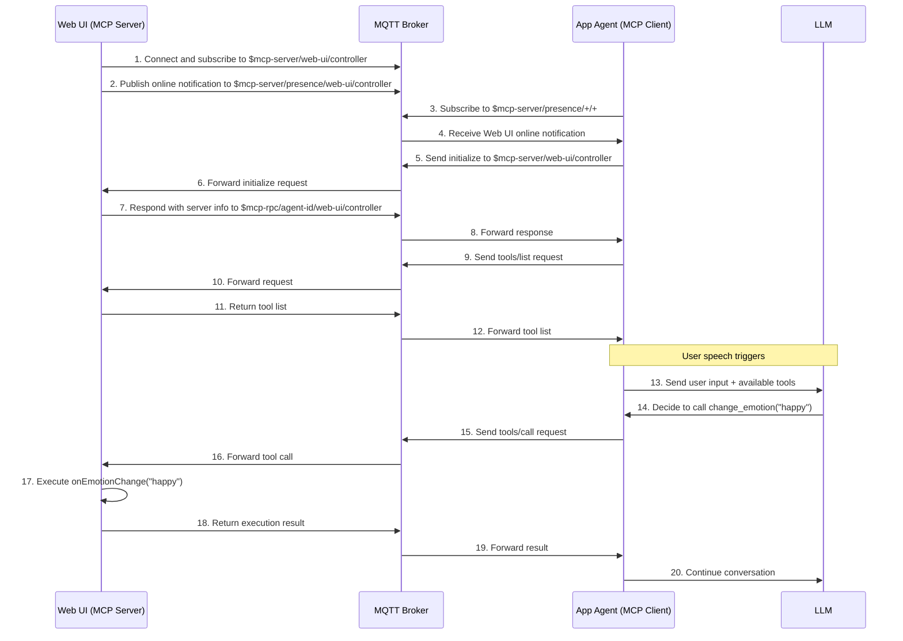

# MCP over MQTT Implementation Documentation

## Architecture Overview

This project implements the MCP (Model Context Protocol) over MQTT specification, allowing the Web UI to act as an MCP Server providing hardware control capabilities for AI Agents to call.

### System Roles

- **Web UI** = **MCP Server** - Provides hardware control tools (camera, emotions)
- **App Agent (Python)** = **MCP Client** - Receives voice, calls LLM, executes tool calls
- **MQTT Broker** = **Message Router** - Responsible for message delivery and routing

### Data Flow

```
User Voice → App Agent → LLM Reasoning → Call Web UI Tools → Hardware Control
                ↓                        ↓
            ASR Recognition          Send requests via MQTT
```

## Core Component Implementation

### 1. MCP Server Class (`lib/mcp-mqtt-server.ts`)

```typescript
export class McpMqttServer {
  private mqttClient: BaseMqttClient       // MQTT underlying connection
  private serverId: string                 // Server unique identifier
  private serverName: string               // Server name
  private callbacks: {                     // Hardware control callback functions
    onCameraControl?: (enabled: boolean) => void
    onEmotionChange?: (emotion: string) => void
  }
}
```

**Key Points**:

- Use `mqttClient` naming to avoid confusion with MCP Client concept
- Decouple hardware control logic from protocol layer through `callbacks`

### 2. Service Registration and Discovery

Server needs to perform the following on startup:

1. Subscribe to control topics to receive requests
2. Publish online notification for Client discovery

```typescript
private async subscribeToMcpTopics(): Promise<void> {
  // 1. Subscribe to control topics to receive initialize requests
  const controlTopic = `$mcp-server/${this.serverId}/${this.serverName}`
  await this.subscribe(controlTopic)

  // 2. Publish online notification (with RETAIN flag to ensure new connected Clients can receive it)
  const presenceTopic = `$mcp-server/presence/${this.serverId}/${this.serverName}`
  const onlineNotification = {
    jsonrpc: '2.0',
    method: 'notifications/server/online',
    params: {
      server_name: this.serverName,
      description: 'Web UI hardware controller for camera and emotion control'
    }
  }
  await this.publish(presenceTopic, JSON.stringify(onlineNotification), { retain: true })
}
```

### 3. Request Handling Mechanism

Server needs to handle three core request types:

```typescript
private handleMcpMessage(message: MqttMessage): void {
  const data = JSON.parse(message.payload) as JsonRpcRequest
  
  // Extract Client ID from topic for response routing
  const topicParts = message.topic.split('/')
  let clientId = ''

  if (message.topic.startsWith('$mcp-server/')) {
    // Control topic - initialization request
    clientId = 'unknown' // Will be updated after initialize
  } else if (message.topic.startsWith('$mcp-rpc/')) {
    // RPC topic - format: $mcp-rpc/{client-id}/{server-id}/{server-name}
    clientId = topicParts[1]
  }

  // Dispatch handling based on method
  switch (data.method) {
    case 'initialize':
      this.handleInitializeRequest(data, clientId)
      break
    case 'tools/list':
      this.handleToolsListRequest(data, clientId)
      break
    case 'tools/call':
      this.handleToolsCallRequest(data, clientId)
      break
  }
}
```

### 4. Tool Definition and Registration

Server provides two hardware control tools:

```typescript
// Returned in handleToolsListRequest
const tools = [
  {
    name: 'control_camera',
    description: 'Control the camera (enable/disable video feed)',
    inputSchema: {
      type: 'object',
      properties: {
        enabled: {
          type: 'boolean',
          description: 'Whether to enable or disable the camera'
        }
      },
      required: ['enabled']
    }
  },
  {
    name: 'change_emotion',
    description: 'Change the avatar emotion/animation',
    inputSchema: {
      type: 'object',
      properties: {
        emotion: {
          type: 'string',
          description: 'The emotion to display',
          enum: ['happy', 'sad', 'angry', 'surprised', 'thinking', 
                 'playful', 'relaxed', 'serious', 'shy', 'tired', 
                 'disappointed', 'laug']
        }
      },
      required: ['emotion']
    }
  }
]
```

### 5. Tool Execution Logic

When receiving tool call requests, execute corresponding callback functions:

```typescript
private async handleToolsCallRequest(request: JsonRpcRequest, clientId: string) {
  const { name, arguments: args } = request.params || {}
  let result: McpToolsCallResult
  
  try {
    switch (name) {
      case 'control_camera':
        // Trigger camera control callback
        if (this.callbacks.onCameraControl) {
          this.callbacks.onCameraControl(args?.enabled)
        }
        result = {
          content: [{
            type: 'text',
            text: `Camera ${args?.enabled ? 'enabled' : 'disabled'} successfully`
          }]
        }
        break
        
      case 'change_emotion':
        // Trigger emotion change callback
        if (this.callbacks.onEmotionChange) {
          this.callbacks.onEmotionChange(args?.emotion)
        }
        result = {
          content: [{
            type: 'text',
            text: `Emotion changed to ${args?.emotion} successfully`
          }]
        }
        break
        
      default:
        throw new Error(`Unknown tool: ${name}`)
    }
    
    // Send success response
    const response = {
      jsonrpc: '2.0',
      id: request.id,
      result
    }
    
    const responseTopic = `$mcp-rpc/${clientId}/${this.serverId}/${this.serverName}`
    await this.publish(responseTopic, JSON.stringify(response))
    
  } catch (error) {
    // Send error response
    const errorResponse = {
      jsonrpc: '2.0',
      id: request.id,
      error: {
        code: -32000,
        message: error instanceof Error ? error.message : String(error)
      }
    }
    
    const responseTopic = `$mcp-rpc/${clientId}/${this.serverId}/${this.serverName}`
    await this.publish(responseTopic, JSON.stringify(errorResponse))
  }
}
```

### 6. React Hook Wrapper (`hooks/useMcpMqttServer.ts`)

Provides an easy-to-use React Hook interface:

```typescript
export function useMcpMqttServer(options: UseMqttOptions): UseMqttServerReturn {
  const [client, setClient] = useState<McpMqttServer | null>(null)
  const [isConnected, setIsConnected] = useState(false)
  const [isMcpInitialized, setIsMcpInitialized] = useState(false)
  
  useEffect(() => {
    const mqttClient = new McpMqttServer({
      serverId: options.serverId,
      serverName: options.serverName,
      callbacks: options.callbacks,
      ...mqttOptions
    })
    
    mqttClient.onConnect(() => {
      setIsConnected(true)
      setIsMcpInitialized(true) // Server is initialized upon connection
    })
    
    if (autoConnect) {
      mqttClient.connect()
    }
    
    return () => {
      mqttClient.disconnect()
    }
  }, [serverId, serverName])
  
  return {
    client,
    isConnected,
    isMcpInitialized,
    // ... other states and methods
  }
}
```

### 7. Application Layer Usage (`App.tsx`)

Integrate MCP Server in the application:

```typescript
function App() {
  const [selectedEmotion, setSelectedEmotion] = useState('happy')
  const [showVideo, setShowVideo] = useState(false)
  
  const { isConnected, isMcpInitialized } = useMcpMqttServer({
    brokerUrl: 'ws://localhost:8083/mqtt',
    autoConnect: true,
    serverId: 'web-ui-hardware-server',
    serverName: 'web-ui-hardware-controller',
    callbacks: {
      onCameraControl: (enabled: boolean) => {
        console.log('[App] Camera control:', enabled)
        setShowVideo(enabled)
      },
      onEmotionChange: (emotion: string) => {
        console.log('[App] Emotion change:', emotion)
        setSelectedEmotion(emotion)
      }
    }
  })
  
  useEffect(() => {
    if (isConnected && isMcpInitialized) {
      console.log('[App] MCP Server ready to receive commands')
    }
  }, [isConnected, isMcpInitialized])
  
  return (
    <ChatInterface 
      selectedEmotion={selectedEmotion}
      showVideo={showVideo}
    />
  )
}
```

## MQTT Topic Specification

According to the MCP over MQTT specification, use the following topic structure:

| Topic Type | Format | Direction | Description |
|------------|--------|-----------|-------------|
| Control Topic | `$mcp-server/{server-id}/{server-name}` | Client→Server | Receive initialization requests |
| Presence Topic | `$mcp-server/presence/{server-id}/{server-name}` | Server→Broker | Publish service online status |
| RPC Topic | `$mcp-rpc/{client-id}/{server-id}/{server-name}` | Bidirectional | RPC requests and responses |
| Capability Change | `$mcp-server/capability/{server-id}/{server-name}` | Server→Client | Notify capability changes |

## Complete Interaction Flow


```mermaid
sequenceDiagram
    participant UI as Web UI (MCP Server)
    participant MQTT as MQTT Broker
    participant Agent as App Agent (MCP Client)
    participant LLM as LLM

    UI->>MQTT: 1. Connect and subscribe to $mcp-server/web-ui/controller
    UI->>MQTT: 2. Publish online notification to $mcp-server/presence/web-ui/controller

    Agent->>MQTT: 3. Subscribe to $mcp-server/presence/+/+
    MQTT->>Agent: 4. Receive Web UI online notification

    Agent->>MQTT: 5. Send initialize to $mcp-server/web-ui/controller
    MQTT->>UI: 6. Forward initialize request
    UI->>MQTT: 7. Respond with server info to $mcp-rpc/agent-id/web-ui/controller
    MQTT->>Agent: 8. Forward response

    Agent->>MQTT: 9. Send tools/list request
    MQTT->>UI: 10. Forward request
    UI->>MQTT: 11. Return tool list
    MQTT->>Agent: 12. Forward tool list

    Note over Agent,LLM: User speech triggers
    Agent->>LLM: 13. Send user input + available tools
    LLM->>Agent: 14. Decide to call change_emotion("happy")

    Agent->>MQTT: 15. Send tools/call request
    MQTT->>UI: 16. Forward tool call
    UI->>UI: 17. Execute onEmotionChange("happy")
    UI->>MQTT: 18. Return execution result
    MQTT->>Agent: 19. Forward result
    Agent->>LLM: 20. Continue conversation
```

## Key Design Decisions

1. **Server rather than Client**: Web UI acts as Server providing tools, rather than as Client calling tools
2. **Callback pattern**: Decouple protocol layer and business logic through callbacks
3. **Clear naming**: Use `mqttClient` to avoid confusion with MCP Client/Server concepts
4. **Stateless tools**: Each tool call is independent, not dependent on session state
5. **Standard protocol**: Strictly follow MCP over MQTT specification to ensure interoperability

## Error Handling

- MQTT connection failure: Automatic reconnection, configured via `reconnectPeriod`
- Tool execution failure: Return JSON-RPC error response
- Message parsing failure: Log and ignore invalid messages
- Timeout handling: Implemented on Client side, Server doesn't need to care

## Security Considerations

- Use MQTT 5.0 User Properties to identify component types
- Add permission verification before tool execution
- Support TLS encrypted connections (configure `wss://`)
- Client ID is used for tracking and auditing

## Future Extensions

1. Add more hardware control tools
2. Implement resource subscription functionality
3. Add tool execution permission control
4. Support batch tool calls
5. Implement tool execution progress feedback
